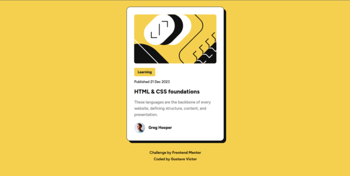
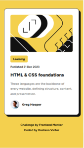

<h1 align='center'>Blog Preview Card</h1>

  <a href="#-sobre">Sobre</a>&nbsp;&nbsp;&nbsp;|&nbsp;&nbsp;&nbsp;
  <a href="#-layout">Layout</a>&nbsp;&nbsp;&nbsp;|&nbsp;&nbsp;&nbsp;
  <a href="#-tecnologias-e-ferramentas">Tecnologias e Ferramentas</a>&nbsp;&nbsp;&nbsp;|&nbsp;&nbsp;&nbsp;
  <a href="#-licença">Licença</a>&nbsp;&nbsp;&nbsp;|&nbsp;&nbsp;&nbsp;

    ✔ Projeto concluído

## ❓ Sobre

Este faz parte de uma desafio da plataforma FrontEnd Mentor. O projeto é basicamente um card simples feito em HTML5 e CSS3. Aqui está o [link](https://www.frontendmentor.io/challenges/blog-preview-card-ckPaj01IcS) para a página do desafio. 

## 🎨 Layout

 

## 🛠 Tecnologias e Ferramentas

- [HTML5](https://developer.mozilla.org/pt-BR/docs/Web/HTML)
- [CSS3](https://developer.mozilla.org/pt-BR/docs/Web/CSS)
- [Visual Studio Code](https://code.visualstudio.com/)

## 📝 Licença 

O projeto está sob a Licensa MIT 

Qualquer pessoa pode usar, clonar e contribuir com este projeto. 

Clique [aqui](./LICENSE) para saber mais  

